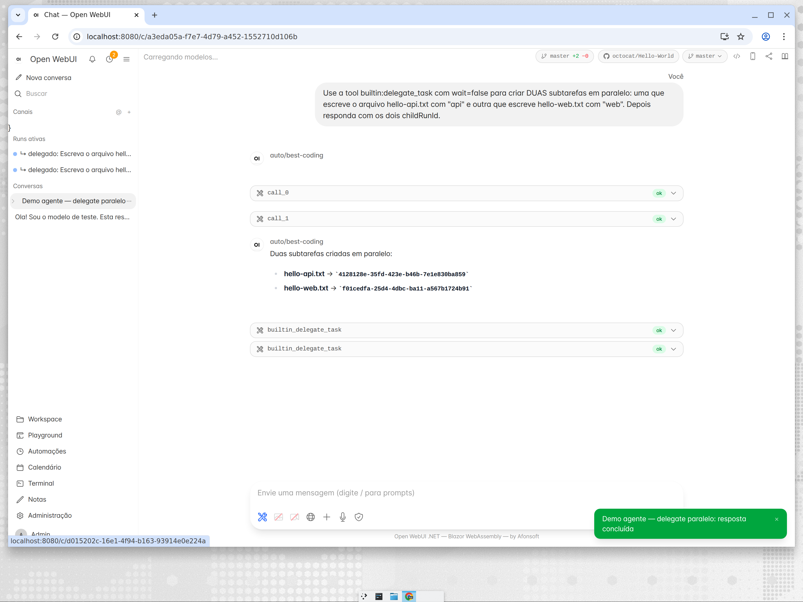
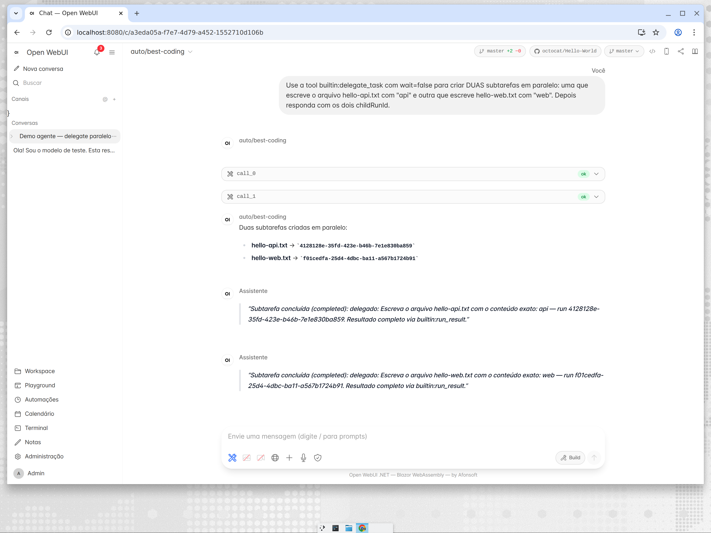
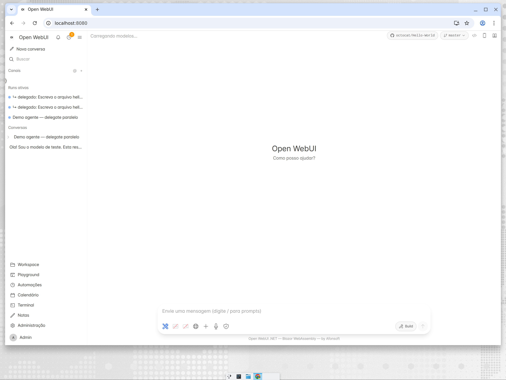
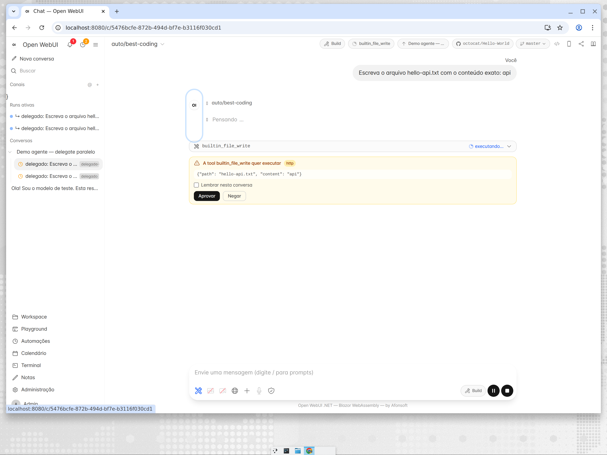
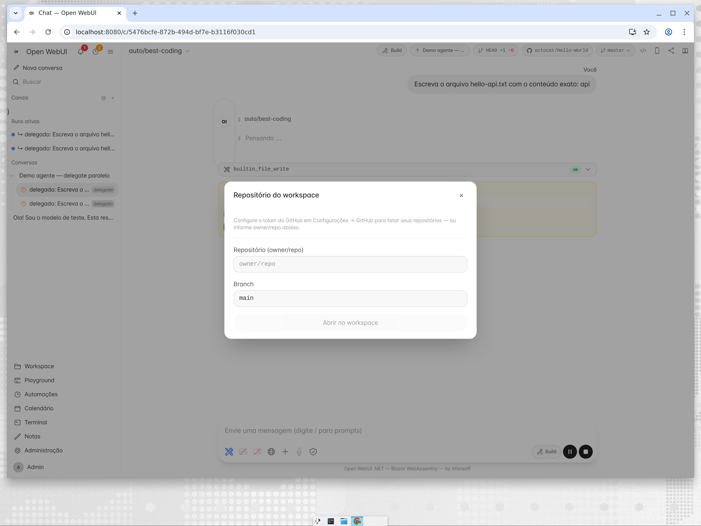
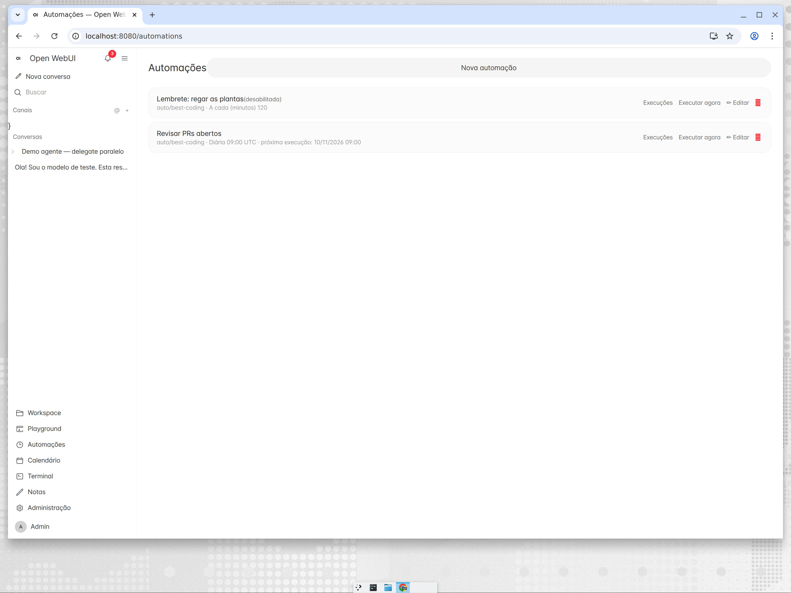
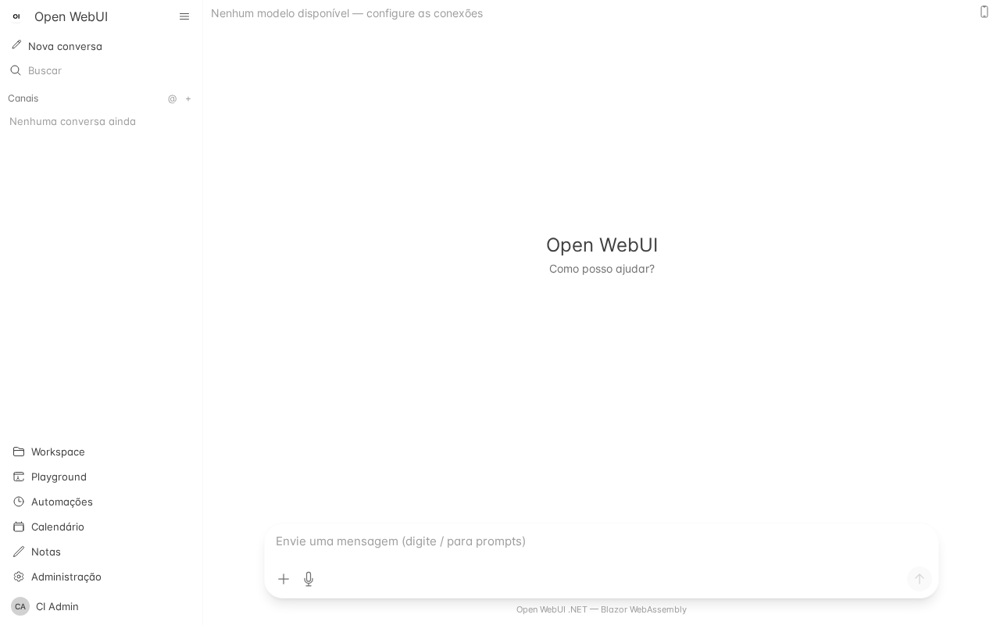
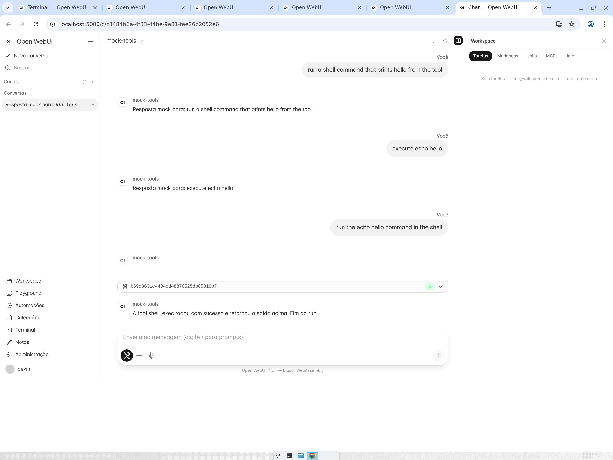
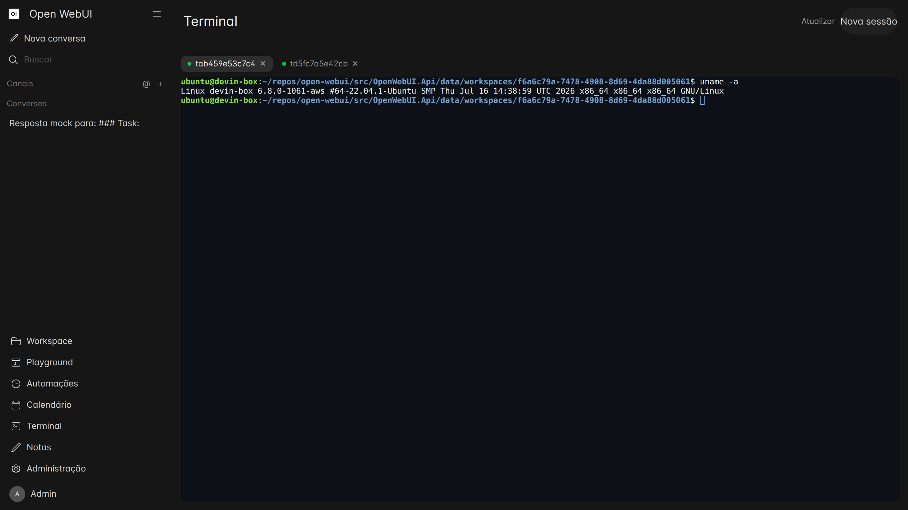

# Open WebUI — .NET (Coding Agent Edition)

A migration of [Open WebUI](https://github.com/open-webui/open-webui) to
**.NET 10 · C# 14 · Blazor WebAssembly** (SvelteKit + FastAPI → ASP.NET Core + Blazor),
faithful to the original layout and configuration — **extended into a full coding-agent
platform** in the spirit of [opencode](https://github.com/sst/opencode): repo-bound
sessions, sub-agents in parallel worktrees, mid-run steering, durable memory,
scheduled routines and a worktree review pipeline.

[](https://github.com/afonsoft/open-webui/actions/workflows/ci-build-test.yml)
[](https://github.com/afonsoft/open-webui/actions/workflows/code-quality.yml)
[](https://github.com/afonsoft/open-webui/actions/workflows/security-scan.yml)
[](https://github.com/afonsoft/open-webui/actions/workflows/a11y-audit.yml)
[](https://sonarcloud.io/project/overview?id=afonsoft_open-webui)

> **Versão em português:** [README.pt-BR.md](README.pt-BR.md)

## Open WebUI (original) vs opencode vs this fork

| Capability | Open WebUI (FastAPI/Svelte) | opencode | **This fork (.NET/Blazor)** |
|---|---|---|---|
| Chat + streaming, multi-provider | ✅ Ollama/OpenAI/RAG/pipelines | ✅ any LLM via gateway | ✅ parity + OmniRoute-friendly |
| Repo/workspace bound to a session | ❌ single workspace | ✅ per-project | ✅ **per-chat binding** (chat → user → none) |
| Sub-agents / parallel sessions | ❌ | ✅ task tool + sessions | ✅ `delegate_task` async, depth ≤3, worktree-isolated |
| Review before merge | ❌ | ✅ orchestrator reviews diffs | ✅ `worktree_diff`/`worktree_merge` + auto-merge opt-in |
| Steer/queue mid-run input | ❌ | ✅ durable steer/queue | ✅ `POST …/runs/{id}/steer` (steer + queue modes) |
| Durable agent memory | ❌ | ✅ memory tools + auto-sync | ✅ `memory_save`/`memory_search` + 6h auto-distill |
| Routines / reminders | ❌ | ✅ routine tool + scheduler | ✅ `routine`/`reminder` tools + `once` schedules |
| Task list tool | ❌ | ✅ todo write | ✅ `todo_write` with stable ids |
| Context compaction | ❌ | ✅ auto-summarize | ✅ LLM summary + cutoff kv |
| Parent/child run tree UI | ❌ | ✅ session tree | ✅ sidebar tree + "delegado" badge + parent markers |
| Parallel runs console | ❌ | ✅ | ✅ sidebar "Active runs" (`GET /chats/runs`) |
| Runs survive browser close | partial | ✅ | ✅ server-side runs + `Last-Event-ID` resume |

## Screenshots

| Delegated sub-agents in parallel | Session tree + completion markers |
|---|---|
|  |  |

| Active-runs console | Sub-session with parent link + approval |
|---|---|
|  |  |

| Per-chat repo binding | Routines & reminders |
|---|---|
|  |  |

| Chat (light/dark) | Workspace panel | Terminal PTY |
|---|---|---|
|  |  |  |

## Agent features (new — additive layer over upstream parity)

- **`delegate_task`** — spawns a child chat + server-side run: `wait:false` returns
  `childRunId` immediately, `wait:true` (default) blocks up to 300s; `repo` and
  `persona` (a workspace Skill as system prompt) params; depth ≤ 3; each sub-agent
  runs in its own **git worktree** so parallel workers never collide.
- **`run_result` / `worktree_diff` / `worktree_merge`** — collect async results,
  review the child diff, merge explicitly (or `auto_merge` opt-in).
- **Steer & queue** — `POST /api/v1/chats/{id}/runs/{runId}/steer` injects a user
  message into a live run (`steer` = next turn boundary, `queue` = when idle).
- **Agent memory** — `memory_save`/`memory_search` (project + global scopes),
  auto-injected `<agent_memory>` block; 6h scheduler distills durable facts into
  `auto:*` memories with per-user watermark + opt-out.
- **Routines & reminders** — `routine` tool (list/create/update/delete/run_now,
  `once`/`interval`/`daily`/`weekly`) and `reminder` (fires an
  `automation.reminder` notification) over the built-in Automations engine.
- **Context compaction** — when history grows, the pipeline summarizes old turns
  through the configured model and keeps a cutoff kv per chat.
- **Retention** — daily purge (automation runs >90d, notifications >60d, steers of
  terminal runs >30d) + worktree orphan prune + WAL checkpoint + weekly VACUUM.
- **Chat hierarchy** — `ParentChatId`/`ParentRunId`, `GET /chats/{id}/children`,
  nested sidebar tree, completion markers posted back to the parent chat.

Full details per feature (with screenshots): [docs/en/AGENT-FEATURES.md](docs/en/AGENT-FEATURES.md) · [docs/pt/RECURSOS-AGENTE.md](docs/pt/RECURSOS-AGENTE.md)

## Classic features (upstream parity)

- **Chat** with SSE streaming (Ollama / OpenAI-compat), attachments, 👍/👎,
  editing, regeneration, LLM-generated title/follow-ups/tags
- **Decoupled runs** — responses execute server-side; closing/reloading the tab
  does not interrupt; on reopen the client reattaches with `Last-Event-ID` replay
- **Notifications** — in-app toasts, Notification API and Web Push (VAPID)
- **Tool streaming + approval gate** — `tool_call`/`tool_result` on SSE, approval
  presets per chat (readonly/approve/always/**auto by risk** LOW-MED-HIGH), deny
  with instructions for the model to correct course
- **Builtin tools** — `shell_exec` + background jobs, `file_*` (list/read/grep/
  glob/write/edit with diff), `code_interpreter`, `fetch_url`, `web_search`,
  `generate_image`/`generate_video`, `browser_screenshot`, `ask_user`,
  `n8n_list_workflows`/`n8n_trigger`, `todo_write`, `skill`, `lsp_*`, `plan_exit`
- **Workspace panel** — Tasks, Changes (git diff), Jobs, MCPs, Terminal (PTY) and
  run Info; draggable resizer; `/ide` full-screen view
- **Plan/Build agent modes** + permission modes; **checkpoints & revert**;
  **pause/resume** runs; slash commands from repo skills
- **RAG, Knowledge, Arena, Channels/Notes/Calendar, Admin (users, connections,
  MCP servers, integrations), i18n in 8 locales, PWA offline shell**

## Quickstart

```bash
dotnet restore OpenWebUI.slnx
dotnet build OpenWebUI.slnx --configuration Release
dotnet run --project src/OpenWebUI.Api   # http://localhost:8080
```

Docker (`:3032 → :8080`):

```bash
docker compose up -d --build
# or the published image
docker run -p 3032:8080 ghcr.io/afonsoft/open-webui:latest
```

Full Docker guide: [docs/en/DEPLOY-DOCKER.md](docs/en/DEPLOY-DOCKER.md) ·
[docs/pt/DEPLOY-DOCKER.md](docs/pt/DEPLOY-DOCKER.md)

## Tests

```bash
dotnet test OpenWebUI.slnx   # 1200+ API tests + client tests (NUnit)
```

Coverage gate via Coverlet + ratchet (`.ci/coverage-baseline.txt` only goes up).

## Quality & CI

| Workflow | Covers |
|---|---|
| `ci-build-test.yml` | Release build, all tests + coverage gate, WASM payload, tailwind freshness, Docker build, baseline ratchet |
| `a11y-audit.yml` | axe-core (Playwright) mobile+desktop |
| `code-quality.yml` | Qodana + [SonarCloud](https://sonarcloud.io/project/overview?id=afonsoft_open-webui) |
| `security-scan.yml` | CodeQL (C#+JS), Trivy, GitGuardian, Snyk |
| `release.yml` | Tag `vX.Y.Z` → GHCR + Docker Hub image |

## Documentation

- [docs/en/AGENT-FEATURES.md](docs/en/AGENT-FEATURES.md) — agent platform details (EN)
- [docs/pt/RECURSOS-AGENTE.md](docs/pt/RECURSOS-AGENTE.md) — detalhes do modo agente (PT-BR)
- [docs/MIGRACAO-DOTNET.md](docs/MIGRACAO-DOTNET.md) — upstream → .NET parity map
- [docs/architecture/architecture.md](docs/architecture/architecture.md) — architecture (Mermaid)
- [docs/analise-fork-alltomatos-opencode.md](docs/analise-fork-alltomatos-opencode.md) — opencode-fork analysis that drove the agent roadmap
- `.specs/` — in-flight SPECs; `docs/specs/` — delivered SPECs
- [CHANGELOG.md](CHANGELOG.md)

## Star History

[](https://www.star-history.com/?repos=afonsoft%2Fopen-webui&type=date&legend=bottom-right)

## License

BSD-3-Clause — see [LICENSE](LICENSE).
