# Open WebUI — .NET

Migração do [Open WebUI](https://github.com/open-webui/open-webui) para
**.NET 10 · C# 14 · Blazor WebAssembly** (SvelteKit + FastAPI → ASP.NET Core + Blazor),
mantendo o layout, as funcionalidades e a configuração do original.

[](https://github.com/afonsoft/open-webui/actions/workflows/ci-build-test.yml)
[](https://github.com/afonsoft/open-webui/actions/workflows/code-quality.yml)
[](https://github.com/afonsoft/open-webui/actions/workflows/security-scan.yml)
[](https://github.com/afonsoft/open-webui/actions/workflows/a11y-audit.yml)

## Screenshots

| Chat (claro) | Chat (escuro) | Login |
|---|---|---|
|  | 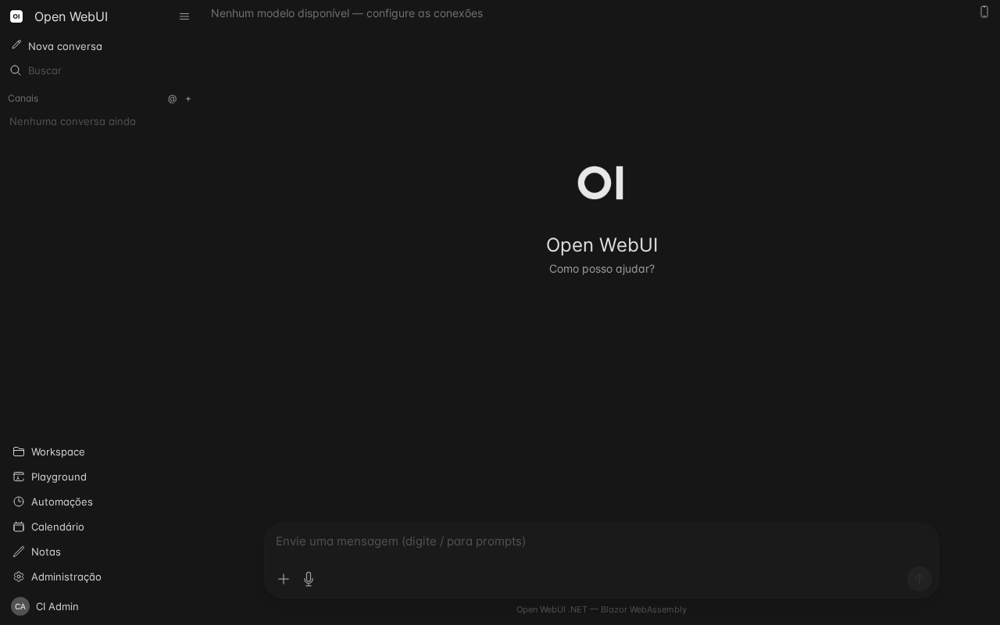 | 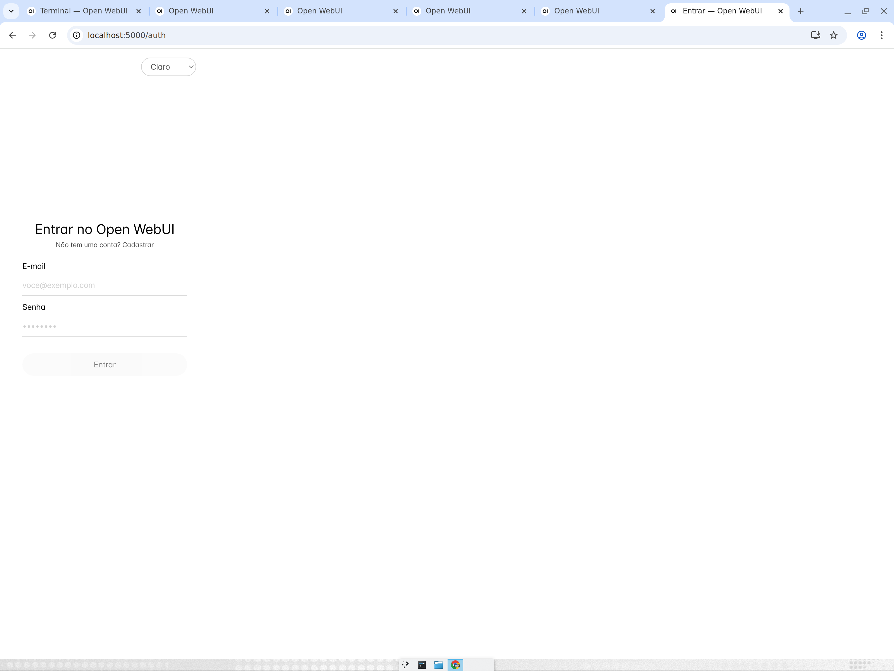 |

| Painel Workspace | Tools no chat | Aprovação de tool |
|---|---|---|
|  | 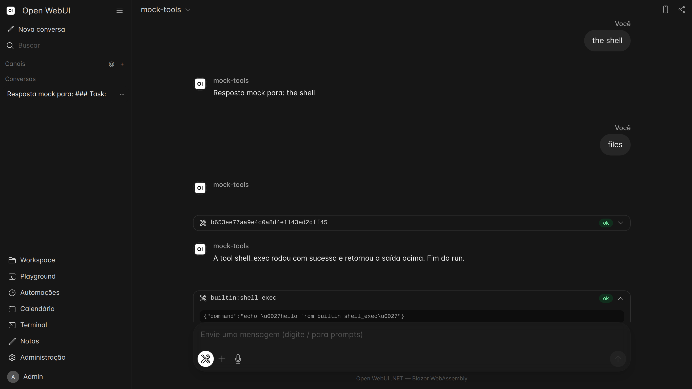 | 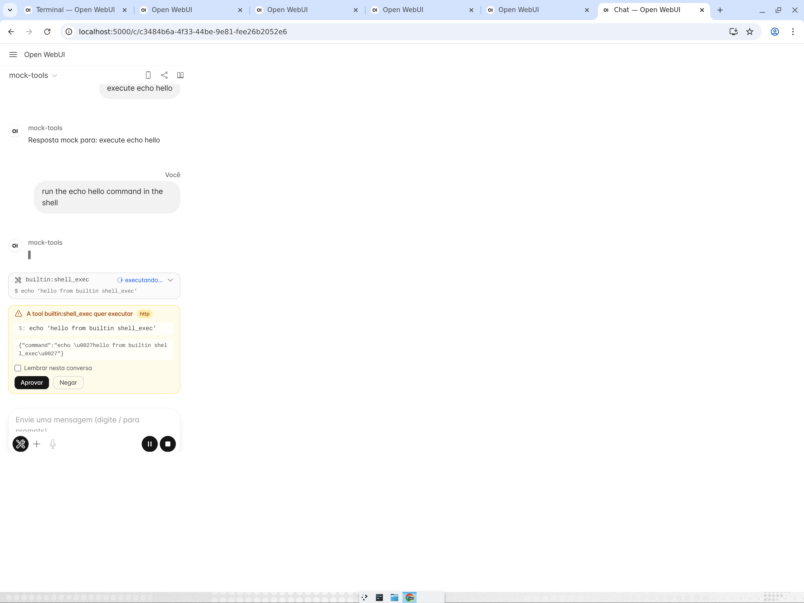 |

| Terminal PTY | MCPs no Admin | Admin — usuários |
|---|---|---|
|  | 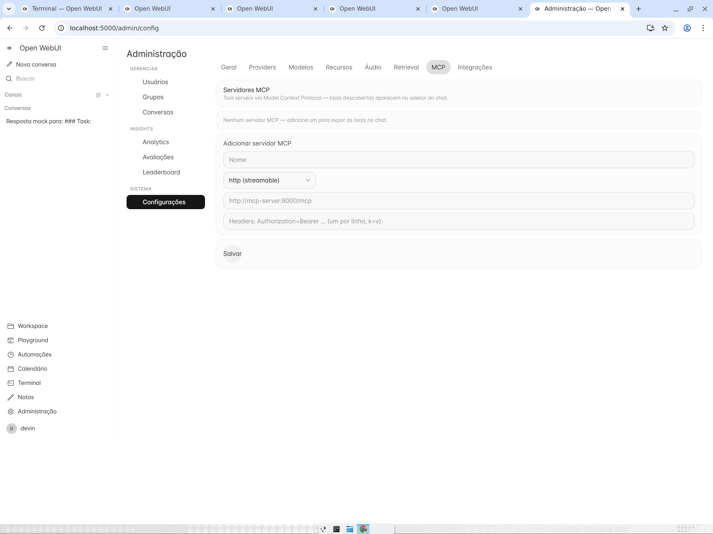 | 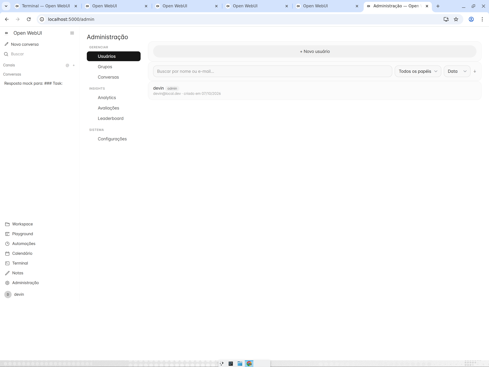 |

| Admin — providers | Admin — integrações | Chat mobile |
|---|---|---|
| 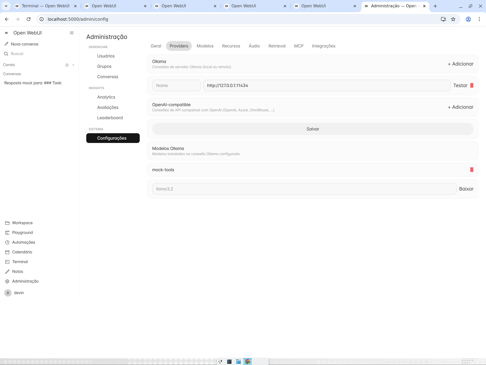 | 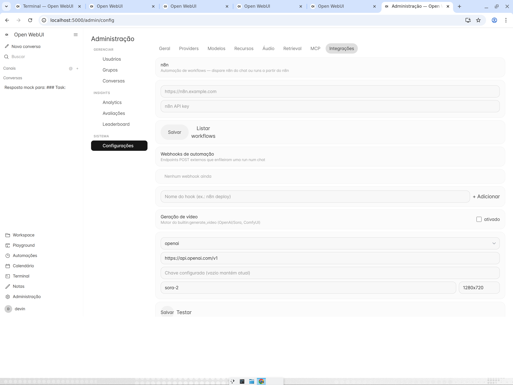 | 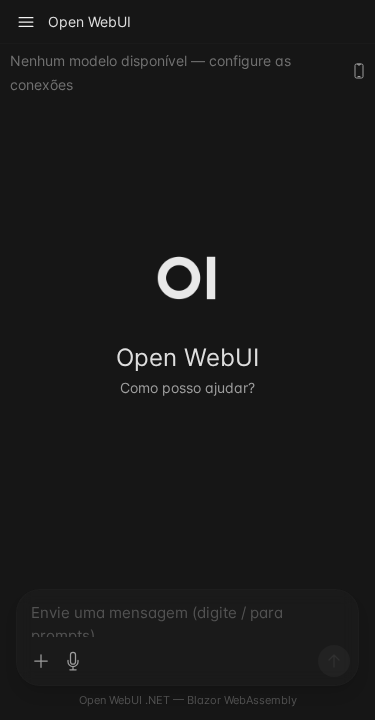 |

| Gaveta mobile | Admin mobile | Login (escuro) |
|---|---|---|
| 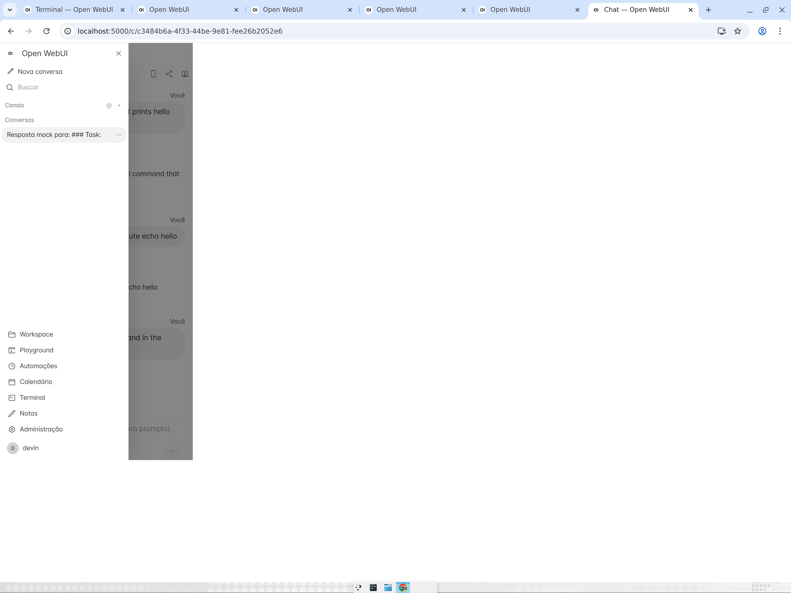 | 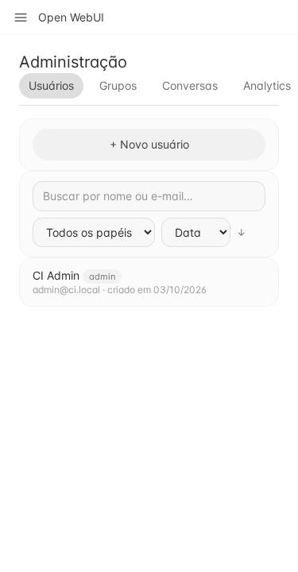 | 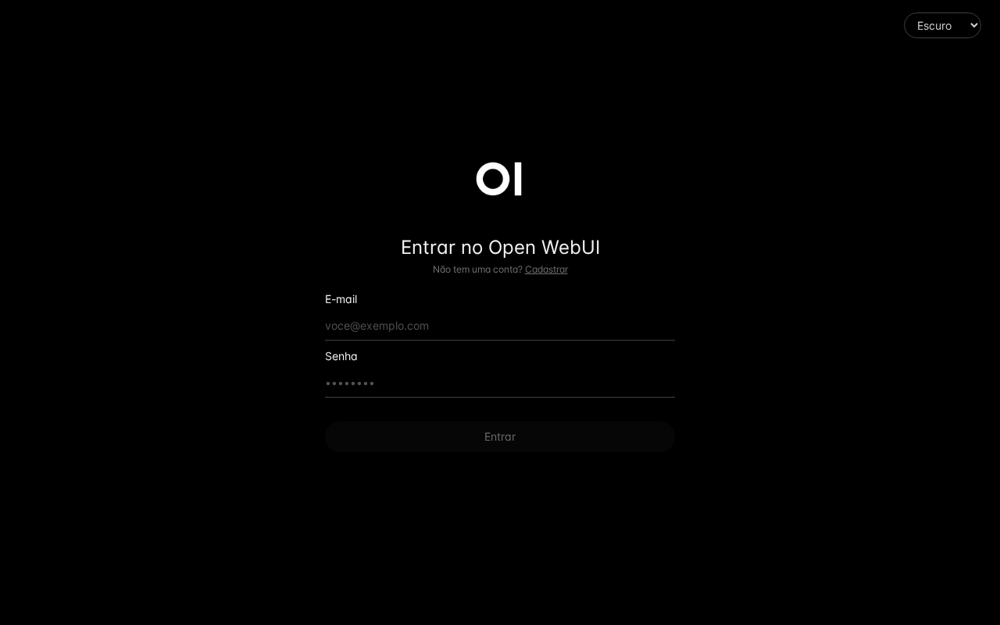 |

## Funcionalidades

- **Chat** com streaming SSE (Ollama / OpenAI-compat), anexos, avaliação 👍/👎,
  edição, regeneração, título/follow-ups/tags gerados por LLM
- **Runs desacopladas** — a resposta roda no servidor: fechar/recarregar a aba não
  interrompe; ao reabrir, o cliente anexa na run ativa com replay do stream
- **Notificações** — toast in-app, Notification API e Web Push (VAPID) para avisar
  quando a resposta termina com o site fechado
- **Tool streaming + aprovação** — `tool_call`/`tool_result`/status no SSE, gate de
  aprovação para tools mutáveis com preset por conversa (readonly/aprovar/sempre/
  **auto por risco** LOW-MED-HIGH), negar com instrução para o modelo corrigir a rota
- **21 builtin agent tools** — `generate_image`/`generate_video` (mídia inline),
  `code_interpreter`, `shell_exec` + jobs em background, `fetch_url`, `web_search`,
  `file_*` (list/read/grep/glob/write/edit no workspace com diff), `todo_write`,
  `ask_user` (pergunta estruturada mid-run), `delegate_task` (subtarefa navegável),
  `browser_screenshot` (Chrome headless), `n8n_list_workflows`/`n8n_trigger`
- **Painel Workspace** ao lado do chat — tabs Tasks, Changes (diff git do workspace),
  Jobs, MCPs e Info/estado da run (padrão Devin/OpenHands)
- **Runs pausáveis** — pause/resume cooperativo + chip de estado da run
  (gerando/aguardando aprovação/pausada)
- **Terminal embutido** — PTY real via WebSocket + xterm.js (`/terminal`, flag admin)
- **Automação inbound** — webhooks anônimos `POST /api/v1/hooks/{token}` enfileiram
  runs no chat (n8n, cron, CI); integração n8n admin (listar/disparar workflows)
- **Canais em grupo** com realtime (SignalR `/ws`), menção `@modelo`, typing/presence
- **Knowledge/RAG** — coleções com embeddings e retrieval vetorial em SQLite
  (cosseno + BM25 híbrido, chunking por frase, rerank por provider externo)
- **MCP** — servidores Model Context Protocol em Admin → Configurações → MCP,
  com teste de conexão e tools expansíveis; tools MCP entram no loop do chat
- **Tools** — tools HTTP com function calling (loop no servidor, URL de execução nunca exposta)
- **Geração de imagens e vídeo** — OpenAI Images/Sora e ComfyUI, botão por mensagem e
  builtin tools `generate_image`/`generate_video` com mídia inline
- **Execução de código** — blocos do chat: JS em Web Worker e Python via Pyodide WASM
- **Voz** — ditado (STT), leitura de mensagens (TTS) e modo Call via Web Speech API
- **Automações** — execuções agendadas (intervalo/diário/semanal) + calendário mensal
- **Auth** — JWT, chaves `sk-*`, OAuth/OIDC (Google/GitHub/Microsoft), SAML, LDAP, SCIM, grupos/RBAC
- **PWA** — manifest + service worker do shell, instalável e offline-safe
- **i18n** — 8 locales (pt-BR, en-US, es, fr, de, it, ja, zh) com troca sem reload
- **Temas** — claro por padrão, seletor claro/escuro/sistema no menu do usuário
- **Mobile-first** — gaveta flutuante com backdrop (clique fora fecha),
  navegação por breakpoints, auditoria axe-core no CI
- **Admin** — rail agrupado (Gerenciar/Insights/Sistema): usuários, grupos, conversas,
  analytics, avaliações, leaderboard + Configurações com abas Geral, Providers
  (Ollama/OpenAI-compat add/edit/testar, pull de modelos), Modelos, Recursos, Áudio,
  Retrieval, MCP e Integrações (n8n, webhooks, geração de vídeo, browser_screenshot)

Mapa de paridade detalhado: [`docs/MIGRACAO-DOTNET.md`](docs/MIGRACAO-DOTNET.md).
Arquitetura: [`docs/architecture/architecture.md`](docs/architecture/architecture.md).

## Comparativo com o Open WebUI original

### Stack

| Camada | open-webui (original) | Este fork |
| --- | --- | --- |
| Frontend | SvelteKit + Tailwind | Blazor WebAssembly + Tailwind v4 (mesmo tema/oklch) |
| Backend | Python FastAPI | ASP.NET Core 10 (Minimal APIs) |
| Linguagem | Python 3.11+ | C# 14 (.NET 10) |
| Banco | SQLAlchemy + SQLite/Postgres | EF Core 10 + SQLite (EF Migrations + baseline de `webui.db` legadas) |
| Realtime | socket.io (Python) | SignalR `/ws` |
| Streaming | SSE | SSE server→client |
| Auth | JWT + bcrypt | JWT + PBKDF2 (PasswordHasher ASP.NET Core) |
| Schema | Alembic/Peewee (migrações Python) | `DatabaseMigrator` + EF Migrations versionadas |
| Execução de tools | Python arbitrário no host | Tools HTTP declarativas + loop server-side |
| Distribuição | Docker / pip / uv | Dockerfile multi-stage / `dotnet` / GHCR + Docker Hub |

### Paridade por área

| Área | Original | Este fork |
| --- | --- | --- |
| Chat (CRUD, pastas, tags, share `/s/`, versões de mensagem) | ✅ | ✅ portado |
| Routers de API (33) | ✅ | ~31 portados · 2 parciais (decisão documentada) |
| Rotas de página (47) | ✅ | ~46 — falta só edição inline de functions no admin |
| Canais/DM + presença | socket.io | ✅ SignalR (mesmo comportamento) |
| Knowledge/RAG | ChromaDB/pgvector externo | ✅ SQLite vetorial embutido (cosseno + BM25, L2 persistida) |
| Tools (function calling) | HTTP + código Python | ✅ HTTP declarativas + 21 builtin agent tools (shell, arquivos, mídia, n8n) |
| MCP tool servers | ✅ | ✅ portado (http streamable + stdio, teste de conexão, tools no chat) |
| Pipelines/functions/skills | ✅ | ✅ registry de functions + pipeline servers externos + skills |
| Arena (battles + ELO) | ✅ | ✅ portado |
| Geração de imagens | ✅ | ✅ OpenAI Images |
| Execução de código (Pyodide) | ✅ | ✅ JS Worker + Python WASM |
| Automações + calendário | ✅ | ✅ portado |
| Auth OAuth/OIDC + SAML + LDAP + SCIM | ✅ | ✅ portado |
| Multi-instância (Postgres/Redis/S3) | ✅ | ❌ não implementado — SQLite + disco local, single-instance |
| i18n | ~30 locales | ✅ 8 locales (fallback en-US → pt-BR → chave) |
| PWA/offline | ✅ | ✅ manifest + service worker |
| Web Search engines | ✅ | ✅ engines configuráveis (tavily, duckduckgo etc.) |

### Divergências intencionais

- **Execução no host, sem sandbox**: builtin tools rodam comandos/código no host do
  servidor — a fronteira de segurança é o gate de aprovação por risco + jail do
  workspace (documentado em MIGRACAO-DOTNET; sandbox isolado é roadmap).
- **RAG self-contained**: embeddings e busca vetorial em SQLite, sem ChromaDB/
  pgvector externo; rerank via provider quando configurado.
- **Single-instance por padrão**: SQLite + uploads em `data/uploads` (fora do
  wwwroot). Postgres/Redis/S3 são roadmap, não código.
- **Qualidade no CI**: coverage gate com baseline ratchet, auditoria de
  acessibilidade axe-core (mobile+desktop) e freshness de Tailwind por build.

## Estrutura (Clean Architecture)

```
├── OpenWebUI.slnx
├── src/
│   ├── OpenWebUI.Domain/          # Entidades de domínio (sem dependências)
│   ├── OpenWebUI.Application/     # Contratos/DTOs compartilhados
│   ├── OpenWebUI.Infrastructure/  # EF Core (AppDbContext + Migrations), serviços
│   │                              # (JWT, providers, RAG, builtin tools, automations)
│   ├── OpenWebUI.Api/             # Minimal APIs + SignalR + hosting do Blazor WASM
│   └── OpenWebUI.Client/          # SPA Blazor WebAssembly (UI do chat)
└── tests/
    ├── OpenWebUI.Api.Tests/       # Testes de integração NUnit (721)
    └── OpenWebUI.Client.Tests/    # Testes NUnit dos serviços do cliente (23)
```

Dependências apontam para dentro: `Api → Infrastructure → Application → Domain`.
O `Client` consome apenas `Application` (contratos).

## Executar

Requisito: SDK do .NET 10.

```bash
dotnet restore OpenWebUI.slnx
dotnet run --project src/OpenWebUI.Api
# http://localhost:8080 — o primeiro usuário cadastrado vira admin
```

Docker:

```bash
cp .env.exemplo .env      # ajuste as variáveis (opcional)
docker compose up -d --build
# http://localhost:3032 (WEBUI_PORT no .env)
# admin inicial semeado via ADMIN_NAME/ADMIN_EMAIL/ADMIN_PASSWORD no .env
```

`docker-compose.yaml` sobe só o app — providers (Ollama/OpenAI) vêm do `.env`
ou de Configurações → Conexões. Para testes locais com toda a infra
(Ollama + Whisper já semeados):

```bash
docker compose -f docker-compose.full.yaml up -d --build
docker exec -it ollama ollama pull llama3.2   # baixar um modelo
```

Imagem publicada (tag `vX.Y.Z` gera release no GHCR + Docker Hub):

```bash
docker run -p 3032:8080 ghcr.io/afonsoft/open-webui:latest
# ou docker.io/afonsoft/open-webui:latest
```

Guia completo de deploy Docker: [docs/pt/DEPLOY-DOCKER.md](docs/pt/DEPLOY-DOCKER.md) / [docs/en/DEPLOY-DOCKER.md](docs/en/DEPLOY-DOCKER.md).

## Testes

```bash
dotnet test OpenWebUI.slnx
# 721 testes de API + 23 de cliente (NUnit)

# Cobertura (Coverlet, exclui Client WASM, código gerado e assemblies de teste)
dotnet test tests/OpenWebUI.Api.Tests \
  --collect:"XPlat Code Coverage" --settings coverlet.runsettings
```

Cobertura de linha/branch por projeto (Coverlet 10):

| Camada | Linhas | Branches |
|--------|--------|----------|
| Domain | 100% | 100% |
| Application | 99,4% | 81,8% |
| Infrastructure | 89,3% | 71,2% |
| Api | 90,1% | 74,8% |
| **Total** | **90,2%** | **73,1%** |

O CI impõe um **gate de cobertura**: `.ci/coverage-baseline.txt` é o piso
exigido em todo PR; o job `coverage-ratchet` sobe a baseline automaticamente
quando a cobertura na `main` melhora (ratchet — nunca desce).

## Qualidade e CI

| Workflow | O que cobre |
| --- | --- |
| `ci-build-test.yml` | Build Release, todos os testes + coverage gate, validação do payload WASM, freshness do `tailwind.css`, build da imagem Docker, ratchet do baseline |
| `a11y-audit.yml` | axe-core (Playwright) contra o app publicado — mobile 375px + desktop, falha em violações `critical` |
| `code-quality.yml` | Qodana e SonarQube (opcionais, secret-gated) |
| `security-scan.yml` | CodeQL (C# + JS), Trivy, GitGuardian, Snyk |
| `release.yml` | Tag `vX.Y.Z` → imagem GHCR + Docker Hub (tag = versão) |

## Documentação

- [`docs/MIGRACAO-DOTNET.md`](docs/MIGRACAO-DOTNET.md) — mapa de paridade upstream → .NET
- [`docs/architecture/architecture.md`](docs/architecture/architecture.md) — diagrama Mermaid da arquitetura
- [`docs/specs/`](docs/specs/) — SPEC SDDs entregues; `.specs/` — SPECs em andamento
- [`CHANGELOG.md`](CHANGELOG.md)

## Star History

[](https://www.star-history.com/?repos=afonsoft%2Fopen-webui&type=date&legend=bottom-right)

## Licença

BSD-3-Clause — ver [`LICENSE`](LICENSE).
