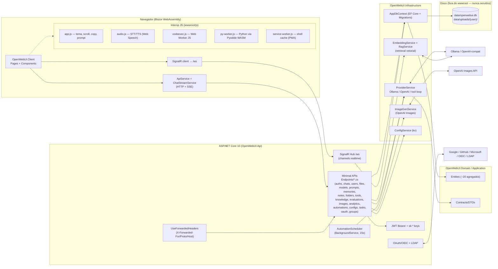
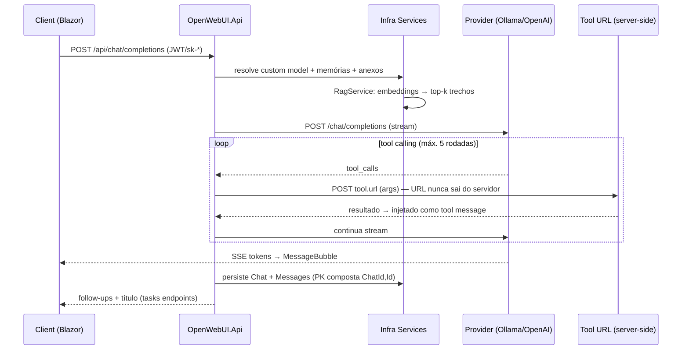
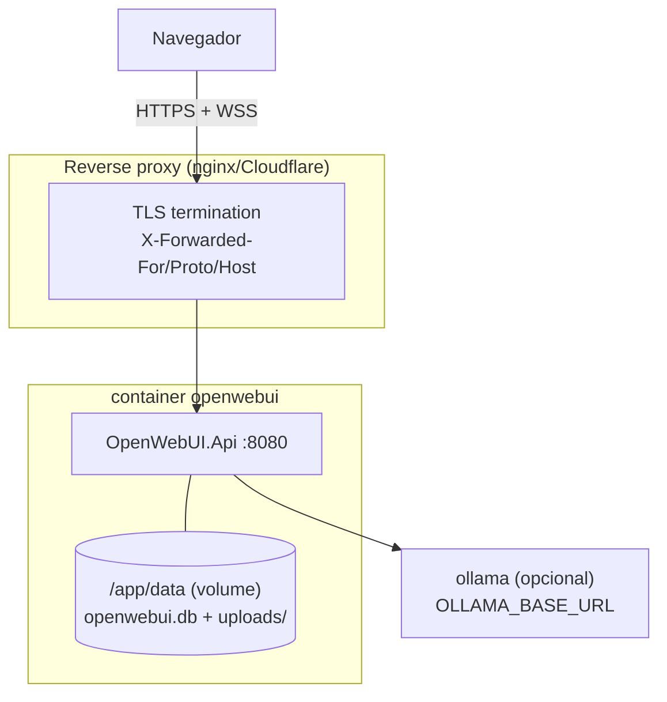

# Arquitetura — Open WebUI .NET

Migração do Open WebUI para .NET 10 / Blazor WebAssembly em Clean Architecture.
Epic de paridade `gap-analysis-20261001` (13 slices, PRs #29–#41) entregue.
ADRs das decisões-chave em [README.md](README.md).

## Visão geral

## Camadas (Clean Architecture)

| Camada | Projeto | Conteúdo | Depende de |
|--------|---------|----------|------------|
| Domain | `src/OpenWebUI.Domain` | Entidades EF (User, Chat, Channel, Knowledge, Tool, Automation…) | — |
| Application | `src/OpenWebUI.Application` | Contracts/DTOs e interfaces de serviço | Domain |
| Infrastructure | `src/OpenWebUI.Infrastructure` | `AppDbContext`, EF Migrations, serviços (JWT, providers, embeddings, imagens, automations, LDAP) | Application |
| Api | `src/OpenWebUI.Api` | Host, endpoints mínimos, SignalR, hosting do WASM | Infrastructure |
| Client | `src/OpenWebUI.Client` | Blazor WASM (pages, components, ApiService, LocalizationService) | Application |

## Sequência — chat completion com RAG + tools

## Deploy

Atrás de proxy o app precisa de `UseForwardedHeaders` — sem ele `Request.Scheme`
devolve `http` e o `redirect_uri` do OAuth sai errado (mesmo padrão do
`agent-harness`). O diretório `data/` fica fora do `wwwroot`: nem
`MapStaticAssets` nem `MapFallbackToFile` o expõem.

## Decisões-chave

- **Persistência**: SQLite via EF Core Migrations (`DatabaseMigrator` faz
  baseline de `webui.db` legadas). Chave composta `(ChatId, Id)` em mensagens.
- **Segredos**: chaves de provider ficam no servidor (`ConfigEntry` kv,
  mascaradas na API); URLs de tools nunca retornam ao cliente.
- **Realtime**: SignalR `/ws` para canais — `message:new`, `typing`, `presence`.
- **RAG**: embeddings por provider + busca por cosseno em SQLite
  (sem vector store externo).
- **Voz/execução**: Web Speech API (STT/TTS), Web Worker JS e Pyodide WASM —
  tudo client-side, degradando silenciosamente.
- **PWA**: manifest + service worker do shell; `Cache-Control: no-cache` no
  documento para evitar loop de reload.
- **i18n**: dicionários `wwwroot/i18n/{lang}.json` carregados no boot do WASM,
  troca de idioma sem reload.
- **CI/CD**: `ci-build-test` (coverage gate + ratchet), `code-quality`
  (Qodana/Sonar), `security-scan` (CodeQL/Trivy), `release` (GHCR + binários).

## Fora de escopo (deferido nos SPECs / gap-analysis)

SAML/SCIM, ComfyUI/A1111, web search RAG (engines de busca), Pipes/Filters,
Jupyter/Open Terminal, Whisper/Kokoro TTS/STT remoto, VAD, DM channels,
threads/reações em canais, arena models, notificações webhook, routers de
passthrough `/ollama/*` `/openai/*`, Postgres, Redis backplane (multi-instância),
comunidade openwebui.com.
