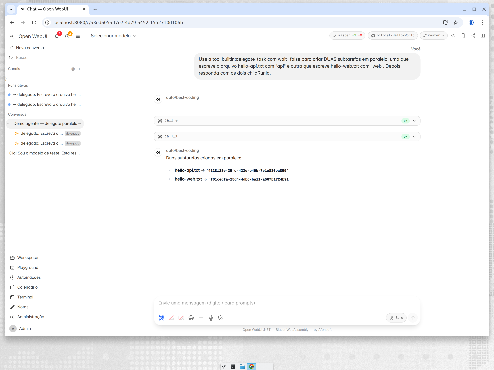

# Recursos de agente — guia detalhado

Tudo abaixo é **camada aditiva** sobre a paridade com o upstream: nenhuma rota
nem o core de gateway foi reestruturado. Cada item lista a superfície
(tool/endpoint/UI), o comportamento e onde aparece na tela.

## 1. `delegate_task` — sub-agentes e sessões paralelas

Cria um **chat** filho mais uma **run** server-side.

```jsonc
// argumentos da tool
{
  "prompt": "Escreva hello-api.txt contendo exatamente: api",
  "wait": false,              // false → retorna { childRunId, childChatId } na hora
  "repo": "owner/outro-repo", // opcional — vincula o filho a outro repo
  "persona": "reviewer",      // opcional — Skill do workspace como system prompt
  "auto_merge": false         // opcional — merge da worktree ao terminar
}
```

- `wait:false` → assíncrono: o resultado é colhido depois via `builtin:run_result`.
- Profundidade limitada a **3** (`MaxDepth`), medida pela cadeia `ParentRunId`.
- Cada sub-run executa na sua própria **git worktree**
  (`{DATA_ROOT}/worktrees/{uid}/{runId}`) — workers paralelos nunca escrevem no
  mesmo checkout.
- O filho herda o **binding de repo por chat** do pai, a menos que `repo` sobrescreva.


## 2. Hierarquia de sessões/runs

- Schema: `Chat.ParentChatId`, `ChatRun.ParentRunId`.
- API: `GET /api/v1/chats/{id}/children` → chats filhos + `lastRunStatus`.
- Sidebar: expansor "Subtarefas" aninha os filhos sob o pai com badge `delegado`;
  o header do filho linka de volta pro **Chat pai**.



Quando uma run filha chega a status terminal, o dispatcher anexa um marcador no
chat **pai** — `Subtarefa concluída (completed): … — run {id}. Resultado
completo via builtin:run_result.` — e a próxima rodada do pai já vê o desfecho
em contexto.


## 3. Revisão antes do merge (pipeline de worktree)

Como cada sub-run vive na sua worktree, a revisão é explícita:

- `builtin:worktree_diff` — diff da worktree do filho contra a branch base.
- `builtin:worktree_merge` — merge da branch da worktree de volta (e limpa a
  worktree depois).
- `delegate_task` com `auto_merge:true` pula a revisão e mergeia no sucesso.

Worktrees órfãs são podadas no boot e diariamente (retenção, abaixo).

## 4. Steer e queue no meio da run

`POST /api/v1/chats/{chatId}/runs/{runId}/steer`

```jsonc
{ "message": "atualiza o README também", "mode": "steer" } // ou "queue"
```

- `steer` — injetado na próxima fronteira de turno da run viva.
- `queue` — só promovido quando a run ficaria ociosa.
- Linhas duráveis (`ChatRunSteers`); steers de runs terminais são expurgados
  após 30 dias pela retenção.

## 5. Console de runs paralelas

`GET /api/v1/chats/runs` devolve as 50 runs mais recentes entre chats
(`ParallelRunResponse` com `ParentRunId`/`ParentChatId`). A sidebar mostra a
seção **"Runs ativas"** para itens queued/running/paused — um clique abre o
chat dono.


## 6. Memória do agente (durável + auto-sync)

- Tools: `builtin:memory_save` (título, conteúdo, escopo `project|global`) e
  `builtin:memory_search` (consulta → memórias ranqueadas).
- Injeção: o pipeline prefixa um bloco `<agent_memory>` com as memórias
  relevantes no system prompt.
- **Auto-sync** (`MemorySyncService`, tick de 6h): por usuário, os chats
  atualizados desde o watermark kv `u:{uid}:memsync.last` são destilados pelo
  modelo configurado em memórias `auto:*` (mantém as 25 mais novas). Opt-out
  com `u:{uid}:memsync.enabled=false`; o watermark só avança quando o provider
  responde — falha = retry no próximo tick.

## 7. Rotinas e lembretes

Sobre o engine de Automações (entidade + scheduler de 15s + CRUD REST em
`/api/v1/automations`, página **Automações** na sidebar):

- `builtin:routine` — `list|create|update|delete|enable|disable|run_now` com
  `schedule` = `once | interval | daily | weekly` (`once` aceita `in_minutes`
  ou `run_at` epoch).
- `builtin:reminder` — mensagem única → automação `once`; ao disparar também
  envia notificação `automation.reminder` pro feed do usuário.


## 8. Compactação de contexto

Chats longos são compactados dentro do pipeline: os turnos antigos são
resumidos pelo modelo configurado e um cutoff por chat (`chat:{id}:compact.*`)
faz a próxima run reprocessar `[resumo] + cauda` em vez do histórico inteiro.

## 9. Retenção de dados

`RetentionService` (tick de 24h) mantém o SQLite enxuto:

- `AutomationRuns` com mais de **90 dias**, `Notifications` com mais de
  **60 dias**, `ChatRunSteers` com mais de **30 dias** **e** cuja run terminou.
- Prune de worktrees órfãs (mesmas regras do boot), WAL
  `checkpoint(TRUNCATE)` e `VACUUM` semanal guardado por kv `sys:vacuum.last`.
- Nunca toca em chats, mensagens, arquivos ou memórias.

## 10. Binding de repo por chat

- kv `chat:{id}:workspace.repo` resolve **chat → global do usuário → nenhum**
  (`Source` informado na resposta).
- `GET`/`PUT /api/v1/chats/{id}/workspace-repo` (owner-only; `PUT null` volta
  ao global). Todas as superfícies de workspace — tools da run, `/ide`, árvore
  de arquivos, barra git, test-run, skills/commands — aceitam `?chatId=`.
- `delegate_task` herda o binding do pai (ou `repo` sobrescreve).


## Referência rápida de API

| Superfície | Rota |
|---|---|
| Enfileirar run | `POST /api/v1/chats/{id}/messages` |
| Steer/queue | `POST /api/v1/chats/{id}/runs/{runId}/steer` |
| Resume do stream | `GET /api/v1/chats/{id}/runs/{runId}/stream?lastSeq=` |
| Diff da run | `GET /api/v1/chats/{id}/runs/{runId}/diff` |
| Filhos | `GET /api/v1/chats/{id}/children` |
| Runs ativas | `GET /api/v1/chats/runs` |
| Binding de repo | `GET`/`PUT /api/v1/chats/{id}/workspace-repo` |
| Automações | `GET`/`POST`/`PUT`/`DELETE /api/v1/automations[/{id}]` (+ `/run`) |
| Memórias | via tools `builtin:memory_*` |
